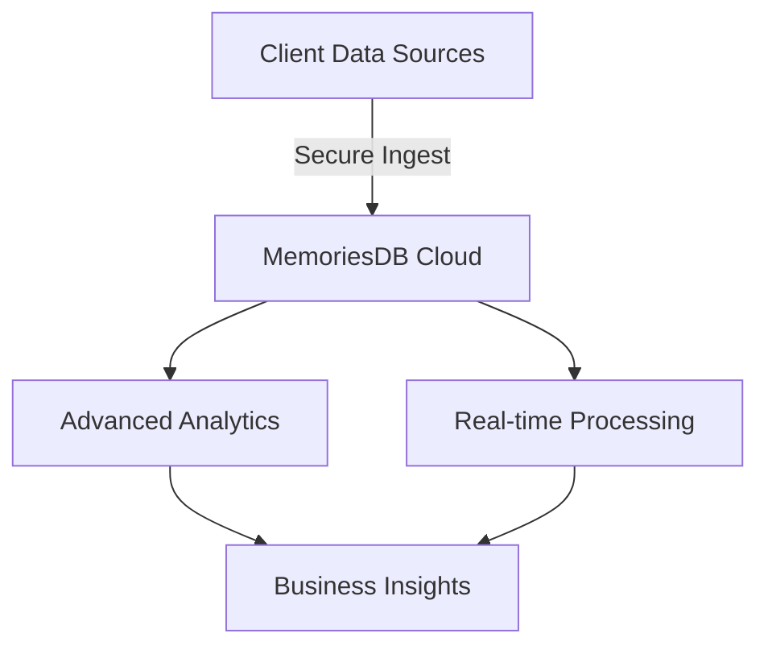
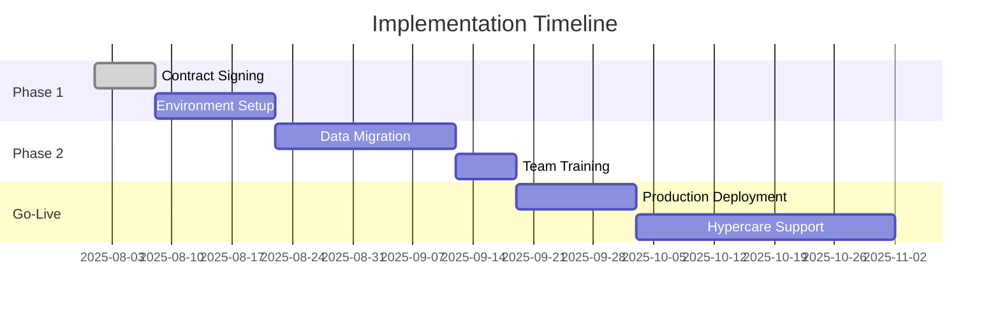

# MemoriesDB Enterprise Proposal

**Prepared for:** [Client Name]  
**Prepared by:** [Your Name]  
**Date:** [Proposal Date]  
**Valid Until:** [Expiry Date]

---

## Executive Summary
MemoriesDB Enterprise delivers an industry-leading graph-vector database with proprietary AI capabilities, enabling [Client] to [solve key pain point]. Our solution provides [specific benefit] while reducing [specific cost] by [percentage].

## Proposed Solution

### 1. Deployment Architecture

### 2. Commercial Terms

| Component | Specification | Annual Cost |
|-----------|---------------|-------------|
| **Base Platform** | Up to 100M nodes, 1B relationships | $250,000 |
| **Advanced Analytics** | Includes ML-powered insights | $75,000 |
| **Dedicated Support** | 24/7 with 15-min response SLA | $97,500 |
| **Implementation** | Onboarding & training | $50,000 (one-time) |
| **Total First Year** | | **$472,500** |
| **Years 2-3** | 18% annual maintenance | $85,050/year |

### 3. Technical Specifications

#### Performance Guarantees
- Query latency: <50ms for 95th percentile
- Uptime: 99.99% SLA
- Throughput: 100,000 QPS per cluster

#### Security Features
- AES-256 encryption at rest
- TLS 1.3 for data in transit
- SOC 2 Type II compliant
- Private VPC deployment

## Implementation Timeline

## Why MemoriesDB?

### Competitive Advantages
1. **Proprietary Algorithms**
   - 42% faster than alternatives (see Appendix A)
   - Patented memory optimization

2. **Enterprise-Grade Security**
   - Zero-trust architecture
   - Hardware security modules

3. **Unmatched Support**
   - Dedicated solutions architect
   - Quarterly business reviews

## Terms & Conditions

### Payment Schedule
- 50% upon signing
- 30% at deployment
- 20% at go-live

### License Agreement
- 3-year term
- Automatic renewal
- 90-day termination notice

### Support & Maintenance
- Includes all patches and minor updates
- Major version upgrades available
- 24/7 support portal access

## Next Steps

1. [ ] Sign NDA (attached)
2. [ ] Schedule technical deep-dive
3. [ ] Sign enterprise agreement
4. [ ] Kickoff implementation

---

**Prepared by:**  
[Your Name]  
Enterprise Sales Director  
MemoriesDB, Inc.  
[Your Email] | [Your Phone]  

---

## Appendices

### Appendix A: Performance Benchmarks
[Detailed comparison vs. Neo4j, Dgraph, AWS Neptune]

### Appendix B: Customer References
[Case studies from similar deployments]

### Appendix C: Compliance Certifications
[SOC 2, ISO 27001, GDPR documentation]

---

*Confidential & Proprietary - © 2025 MemoriesDB, Inc. All rights reserved.*  
*This proposal is valid for 30 days from the date of issue.*
